## 飞鸟快验网络验证,一个基于go 高性能,易管理,快对接更自由  WebApi网络验证后台

## 特点目标
免费开源,功能多,性能强,二开自由(云变量,云函数,用户apiHook,用户云配置,等等)

支持定时任务(http请求,sql执行,云函数执行)

支持单账号登录多应用(余额共享,应用积分,会员时间,用户云配置,独立)一处注册处处登录

支持各种收款方式,支付宝,微信,小叮当,虎皮椒,易支付

支持代_理代收款,(这个还是挺好的, 用户付款直接进代_理账号,资金流不进j系统更安全)

任务池,内置高性能任务生产消费队列模型轻松异步处理长耗时的函数,卖接口之类的很方便,

大数据可视化大屏(其实就是图表,分析各种数据显示)

支持用户api加密,有效防止山寨服务器

支持给软件用户设置vip级别,支持切换按权重自动修改到期时间

支持apk一键加弹窗验证和exe一键加验证(vmp一机一码防山寨),更适合新手用户

## 技术栈
前后端分离
管理员后台前端：vue3 + element-plus
代_理平台前端：vue3 +element-plus
开发环境：go1.2 + MySQL5.7

# 功能介绍
## 用户管理
|功能|介绍|
|-|-|
|在线管理|在线用户查看  登录注册用户分类图表统计,踢出,新建WEBApi令牌等等|
|用户管理|账号增删改查,图表分析,余额查看等等,该验证的账号登录机制为,当作者有软件A和软件B的时候，用户在软件A注册的账号同时也可用于登录软件B，但软件的授权到期时间和积分等数据不互通,但是余额数据互通,这样更自由|
## 应用管理
|功能|介绍|
|-|-|
|应用管理|应用增删改查,编辑 收费模式(账号计时,账号计点,卡号计时,卡号计点) 应用vip数据,专属云变量 支持逻辑 短文本,超长多行文本,安全设置 明文 AES,RSA通讯加密,接口验证码(英数,短信,行为)配置,|
|软件用户|软件用户的增删改查,用户注册图表统计,用户绑定信息时间积分编辑,单独用户备注(可以用来给用户单独定制功能)|
|用户类型|用户类型的增删改查,比如vip1,vip2,等等 支持整数代号, 权重, 可以根据每个用户类型权重,自由切换用户类型,会自动根据权重修改对应类型的剩余会员时间|
|卡类列表|卡类列表(卡号类型的增删改查,设置备注时间点数余额积分,用户售价代_理售价,不同用户类型是自动转分组还是禁止充值,等等)|
|卡号管理|卡号的增删改查,编辑卡号,追回卡号(就是把充值用户的时间扣回来), 管理备注,,应用卡类统计,数量统计图表,批量导出csv,导入误删卡(因为卡号有算法校验,所以只能导入本系统生成的卡号)|
|黑名单管理|可以拉黑用户ip或绑定信息,可以全局拉黑,也可以指定应用拉黑|

## 财务管理
|功能|介绍|
|-|-|
|支付充值订单|所有支付订单都在这里统计包含代_理代收款订单,如自助购卡, 购卡直冲(就是续费),充值余额积分,订单备注等等 ,支持支付宝微信的操作全退货部分退款(也可以在配置文件中关闭这个功能,为了安全),还可以手动给指定用户充值余额)|

## 系统管理
|功能|介绍|
|-|-|
|系统设置|管理后台WebApi host设置,可以让管理和WEBapi使用不同域名,更安全,用户API加密盐(给用户api接口进行+盐取摘要,有效防止山寨服务器),代_理开关等|
|支付设置|支持`支付宝`(电脑网页支付,当面付,h5)`微信`支付(扫码),`小叮当`,等支付通道,支持显示别名,支持开关,同步代_理充值和用户充值,支付通道|
|短_信平台|主要用来短_信验_证码,支持腾_讯云|
|行为验证平台|暂时只支持,极_验|

## 二开扩展
深知每个用户都有自己的个性化需求,所以系统支持二开扩展功能,已达到各种需求
二开还是费了很多心思的,毕竟每个人需求不同,系统不可能全做完

|功能|介绍|
|-|-|
|公共变量|支持逻辑型,单行文本,多行文本,这个和应用管理内的专属云变量很像,但是这里的变量无需登录就可以获取,专属云变量可以限制必须登录才可以获取|
|公共函数|就是js函数,内置了一些操作用户等信息的中文公共函数api(函数名为中文,可读性强我还是很喜欢中文的),还可以hook用户api,方便二开扩展|
|任务池|一个`高性能生产消费队列模型`,如果公共函数执行时间过长, 保持http长连接很限制并发,直接用这个,投递任务返回uuid,然后异步用UUid读取任务结果,很适合接口类型,还支持hook,就是投递前后或返回前后,可以用公共能函数操作扣费之类的,特别方便, |
|用户云配置|可以通过公共函数进行用户云配置的读写,每个应用用户都独立|
|定时任务|可以定制执行一些功能,目前支持`http请求`,`sql语句`,`公共函数`(有这个可以执行的功能就很多了)|

## 代_理管理
|功能|介绍|
|-|-|
|代_理账号|一级代_理账号增删改查,代_理架构图表,功能授权(卡号`冻结``解冻``追回`,余额`充值`,`转账`,`发展下级`,`修改用户绑定`,`更换卡号`,`代收款`(这个特别实用,详情查代_理说明)) 可制卡授权(可以根据应用分类授权卡类ID)|
|库存管理|除了下级购卡上级分成方式,还可以直接上级给下级制卡库存包,支持限制时间,上级还可以撤回下级的库存,库存创建人,可以重置有效时间,这样下级完全由上级控制,不用在系统内充值余额,多种发展选择|

## 日志管理
|功能|介绍|
|-|-|
|用户消息|用户可以反馈投诉建议bug,或系统内部风控消息,等等, 我都是异常捕获全局,然后反馈异常到这里,用来排查bug,很方便,支持,是否显示已读|
|登录日志|用户,代_理,管理员,登录记录|
|余额日志|用户余额扣费,管理员手动编辑余额日志,只要余额变化,就会有日志,充值消费图表分析,  百万+记录,数据秒返回,之前php验证就是这里数据多了直接卡死不返回,每次都得自己到后台数据库处理,其他日志也做了优化|
|库存日志|制卡库存包的增删改查,库存转移撤单等等记录|
|积分点数|积分点数的增减日志,同样支持百万+数据秒返回,这些操作都是可以通过公共函数js操作扣除的, 积分点数消费图表|
|制卡日志|卡号的增删改查,都会在这里显示,包括用户直接购卡, 会显示订单ID,方便查漏补缺|

更多的是一些细节,比如复制卡号,配置等等,能动鼠标绝不用键盘,使用360安全浏览器测试开发,所以也推荐用用这个,兼容性比较好,或者Edge测试兼容也挺好的.

## 后期维护
作者自己也在用这个验证,所以会持续维护,欢迎反馈bug.

官网 (http://www.fnkuaiyan.cn)    
交流群:[668607731](http://qm.qq.com/cgi-bin/qm/qr?_wv=1027&k=iyl0mMsPAJdFCzCB4BPuVBqZAG-7nnuM&authKey=hGKOaQ2rZ%2BDBO5Zir4YoepYA0K9l8wLdOuMWctzHBWaD3h9oFrBIrMChelOJ2jQ0&noverify=0&group_code=668607731)      
码云仓库开源地址  
GO后端    
https://gitee.com/anyueyinluo/KuaiYanGo2   
WEB管理员前端  
https://gitee.com/anyueyinluo/KuaiYanWeb  
## 截图简洁 更多更新情况请查看官网演示站,

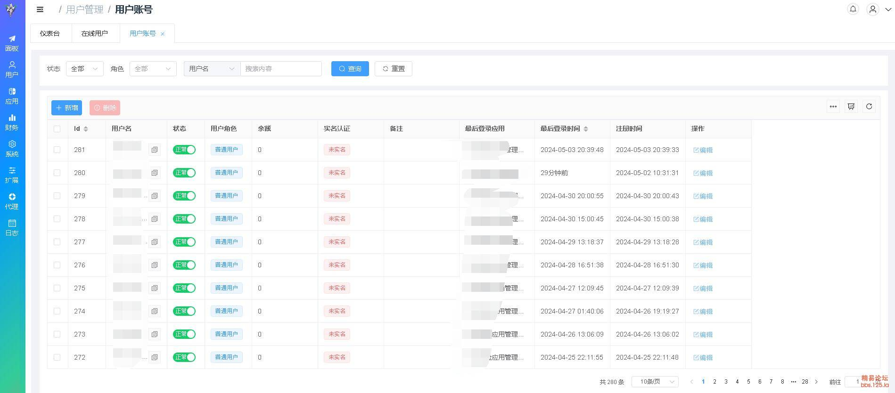
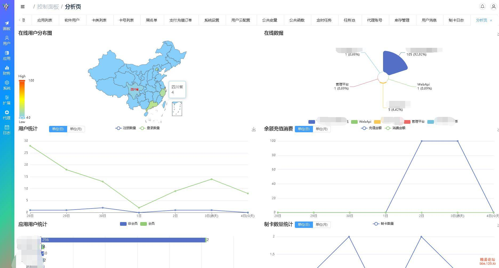
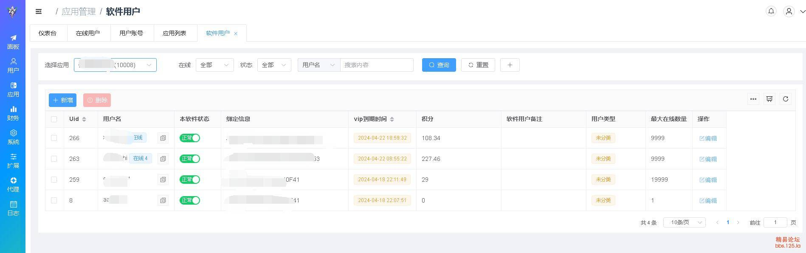
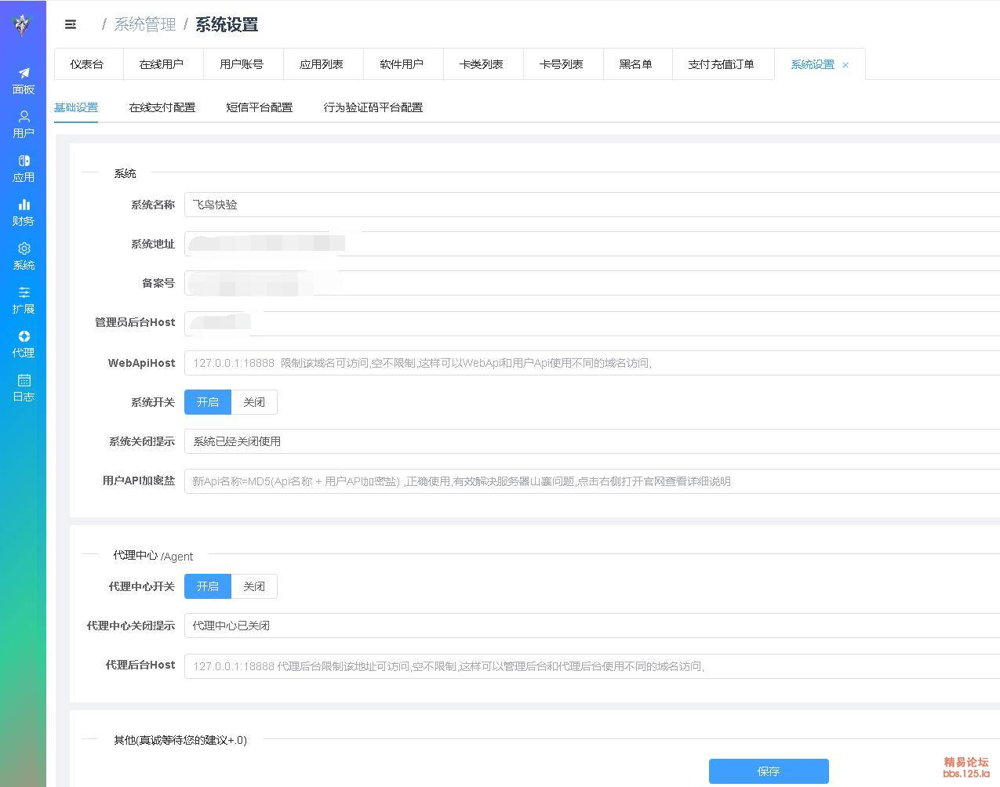
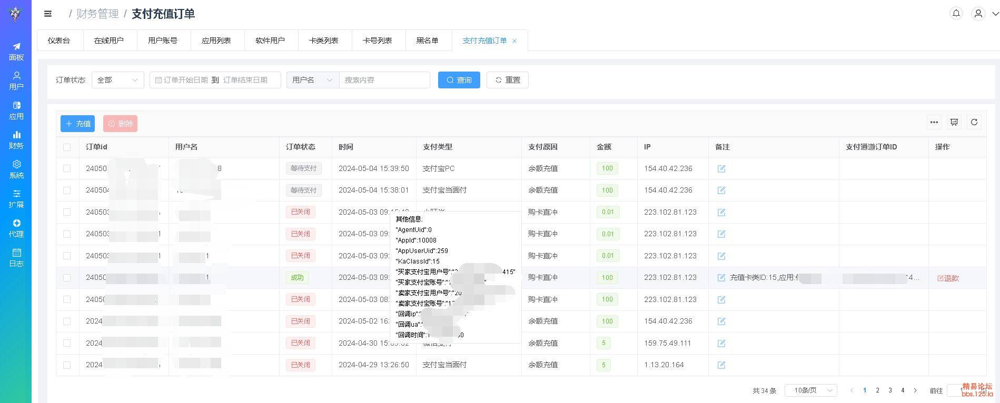
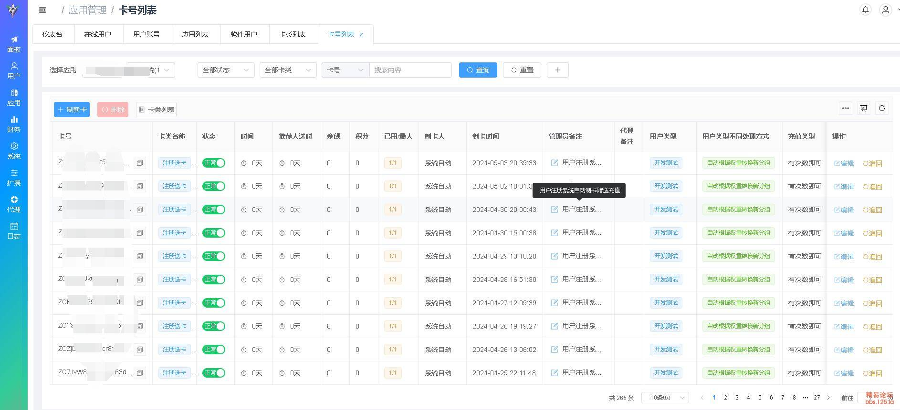
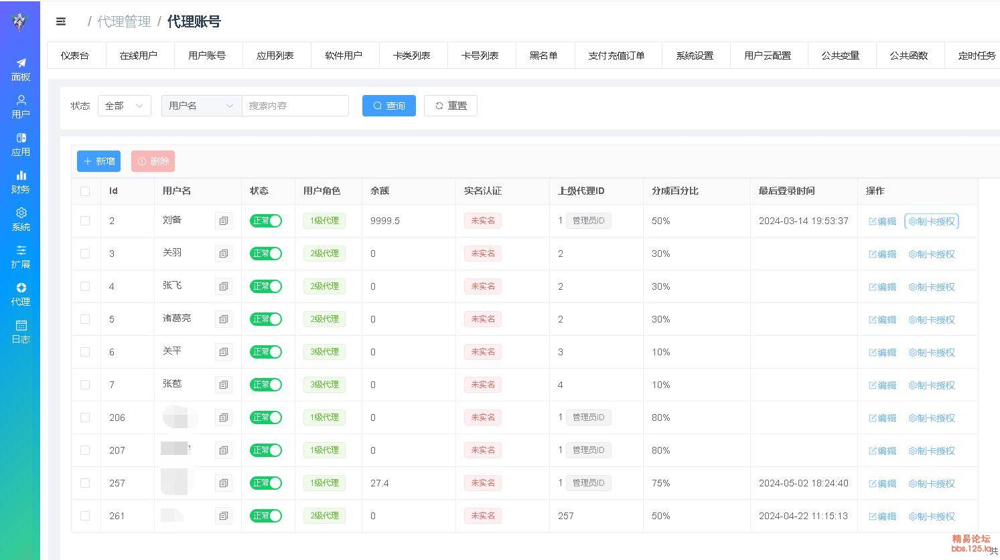
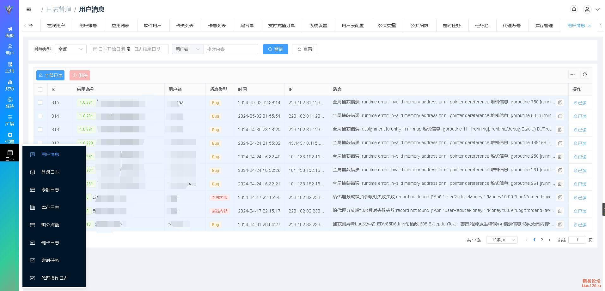
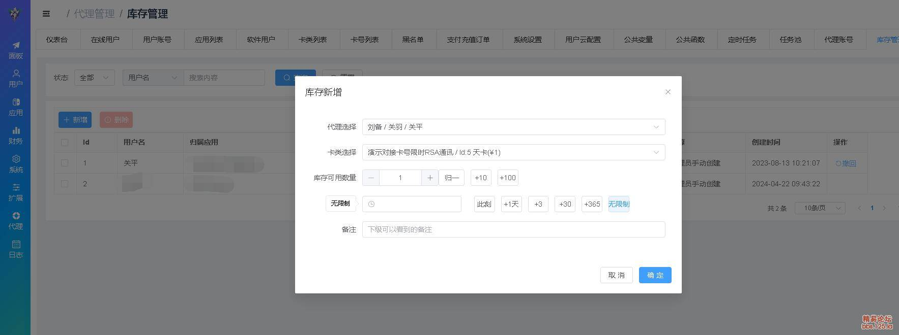
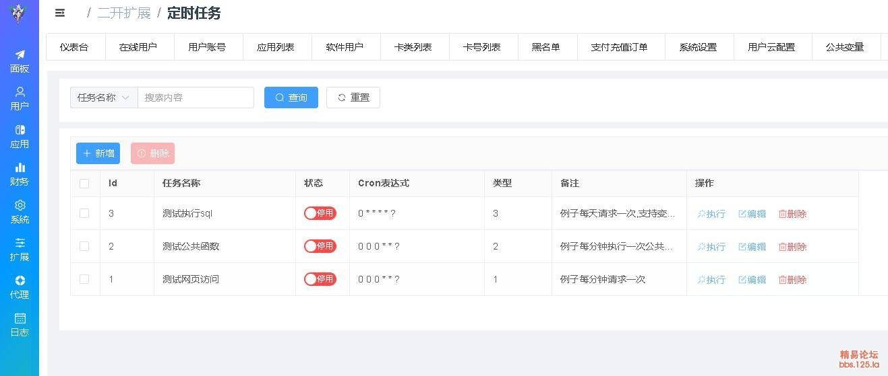
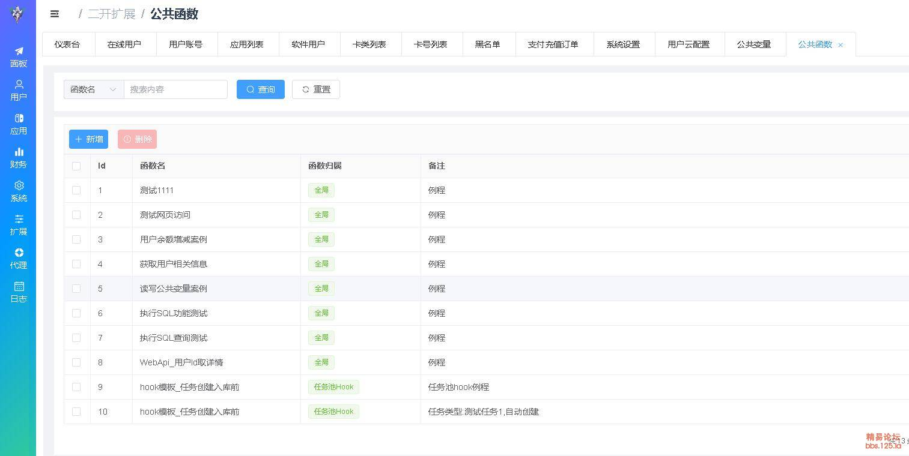
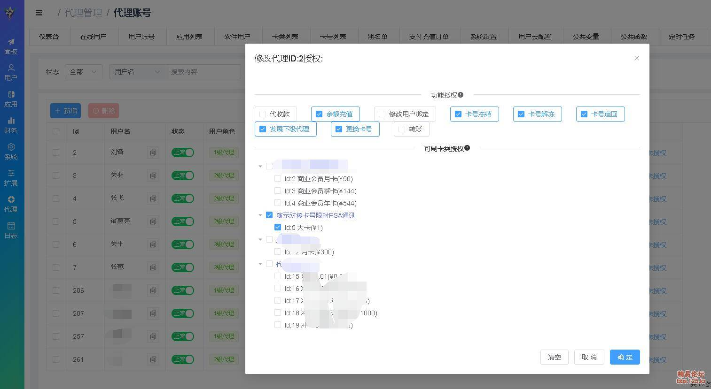
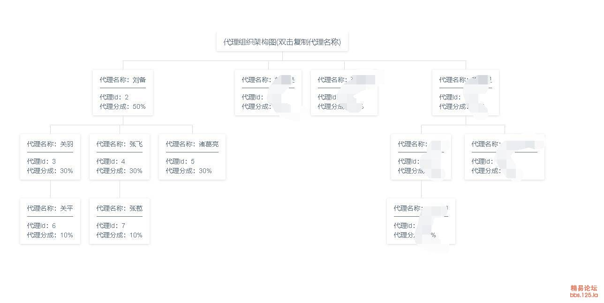

